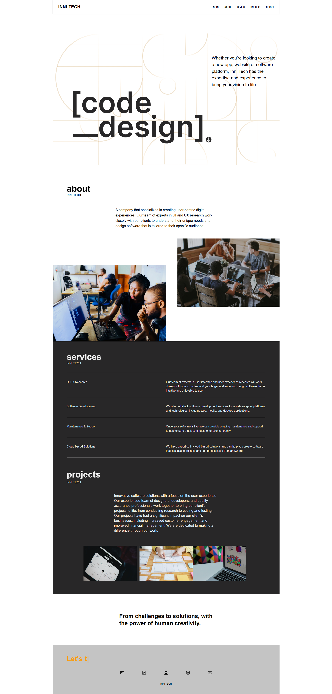

<h1>Inni Tech</h1>

Projeto criado com ReactJS

 

   

## Tecnologias

Esse projeto foi desenvolvido com as seguintes tecnologias:

- ReactJS
- HTML e CSS
- TailwindCss
- Formik e Yup

## Projeto

Com intuito de estudar ReactJs, criei a página responsiva de uma empresa que desenvolve produtos digitais, com o design centrado no usuário.

## Github pages

Visite a página [Link](https://kari-osk.github.io/innitech/)

[^1]: Todas as fotos são do [unsplash](https://unsplash.com/pt-br)
